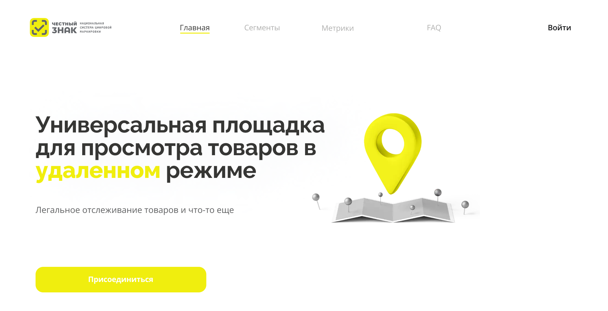

  

# PredictionPower
🟡 Data Collection: The web application will collect data from the data set provided by "честный знак" to perform predictive analysis and compile metrics.

🟡 Data Cleaning and Processing: The collected data will be cleaned and processed to remove any errors or inconsistencies and transform it into a structured format suitable for analysis.

🟡 Predictive Analysis: The application will use machine learning algorithms and statistical techniques to perform predictive analysis on the data set, identifying trends and patterns to make predictions and recommendations.

🟡 Metrics Compilation: The application will compile relevant metrics and generate reports based on the results of the analysis, providing valuable insights to the company and its stakeholders.

🟡 User Interface: The application will feature an intuitive and user-friendly interface that allows users to interact with the data, view reports and visualizations, and customize parameters for analysis.

🟡 Security and Privacy: The application will ensure the security and privacy of the data set by implementing appropriate security measures and complying with data protection regulations.

## Exploitation
🟡 Web  - ask [@tw0ch](https://t.me/tw0ch) for preview

## Application Development

- *Egor Mizyulin* - Mobile dev [@tw0ch](https://t.me/tw0ch)
- *Mike Nedviga* - Mobile dev [@nondescr1pt](https://t.me/nondescr1pt)
- *Nikita Sergievsky* - Backend dev [@codeyouth](https://t.me/codeyouth)
- *Tatiana Bobyleva* - Design [@tattumm](https://t.me/tattumm)
- *Maxim Zhukov* - Design [@By_od1](https://t.me/by_od1)
- *Vasily Dzerzhinsky* - Design [@MartinLuteranin](https://t.me/MartinLuteranin)
- *Daniil Orlov* - Product/Project manager [@MrOrlov_1](https://t.me/MrOrlov_1)